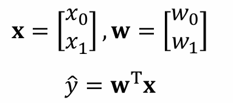
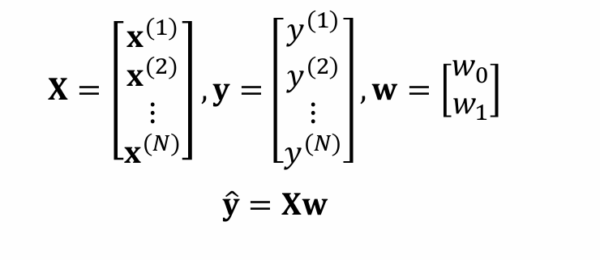
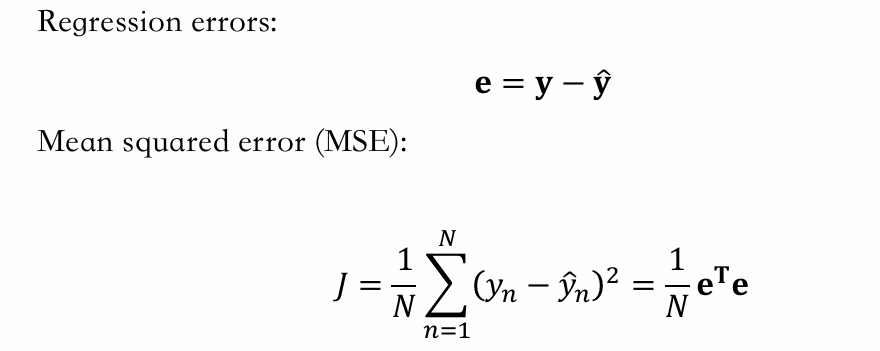
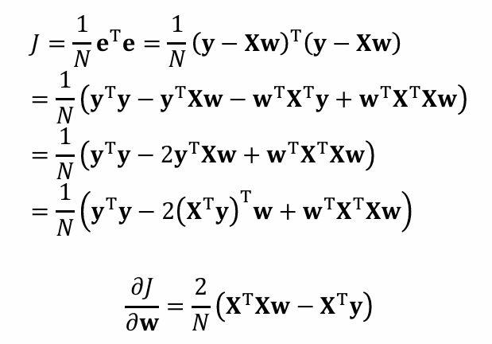
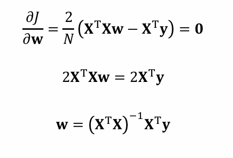
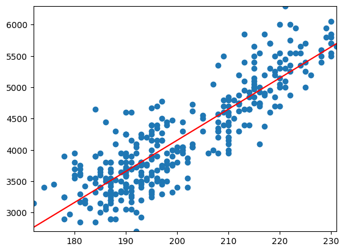
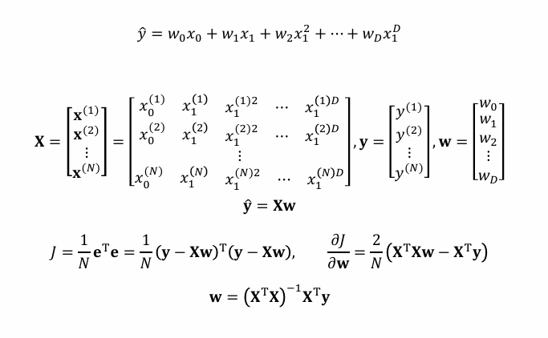
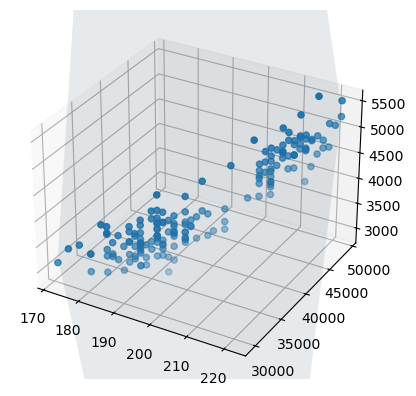

# 人工智能的编程基础笔记
## 前言：penguin示例的数据处理技术
我们在南极岛上有一帮企鹅，这些企鹅在三个岛上，在科学家的观察下，他们有以下几种数据：
* 我们先用命令打开这个txt看看结果：
```python
def read_data(filename):
    with open(filename) as f:
        lines = f.readlines()
    header = lines[0].strip()
    column_name = header.split(',')
    return column_name

filename = "data\palmer-penguins\palmer-penguins.txt"
column_name = read_data(filename)
print(column_name)
```
这里输出的结果是
```python
['species', 'island', 'bill_length_mm', 'bill_depth_mm', 'flipper_length_mm', 'body_mass_g', 'sex', 'year']
```
* `strip()` 和 `split()` 是 Python 中常用的字符串处理方法

1. **strip()**:
   - 用于去除字符串开头和结尾的空白字符（包括空格、换行符、制表符等）
   - 不会改变字符串中间的内容
   - 如果不带参数，默认去除空白字符
   - 示例：`"  hello world  ".strip()` 返回 `"hello world"`

2. **split(',')**:
   - 用于将字符串按照指定的分隔符（这里是逗号）拆分成多个子字符串
   - 返回一个包含拆分结果的列表
   - 示例：`"a,b,c".split(',')` 返回 `['a', 'b', 'c']`
* 大概知道有哪几种标签后，我们需要把这些csv里面的数据转成python自己的数据类型——列表：
* 代码实现：
```python
def string2float(str):
    return float(str) if str != '' else None
def read_string(filename, col):
    with open(filename) as f:
        lines = f.readlines()
    item = [line.strip().split(',')[col] for line in lines[1:]]
    return item
def read_float(filename, col):
    with open(filename) as f:
        lines = f.readlines()
    item = [string2float(line.strip().split(',')[col]) for line in lines[1:]]
    return item
species = read_string(filename, col = 0)
island = read_string(filename, col = 1)
bill_length = read_float(filename, col = 2)
bill_depth = read_float(filename, col = 3)
flipper_length = read_float(filename, col = 4)
body_mass = read_float(filename, col = 5)
```
经过这样的代码操作，我们就可以获得结构化的数据，请注意：**这些代码需要读者自行复现才能真正被理解。**

## 回归模型
### 1.线性回归模型1.0版本
* 模型的建立与一步步优化

对于一连串离散的点，如果我们要采用一条直线（线性）来做拟合，我们对这条直线最基本的假设是：有这么一个权重w来加到自变量上，也有这么一个偏置量加到wx后，用数学方式表达就是：

$$ y = wx + b $$
在这个penguin的示例中，我们用flipper_lengnths来预测body_mass,


|| bias | flipper_length | body_mass |
|-|------|----------------|-----------|
|自变量|  1    |    x            |       y    |
|系数|b      | w|y|

我们的核心思路是**用矩阵**规整化这个线性运算——也即把线性运算用矩阵形式做简化表达，进而进一步做研究：
|| bias | flipper_length | body_mass |
|-|------|----------------|-----------|
|自变量|  1    |    x            |       y    |
|系数|w0     | w1|y|

我们可以用矩阵形式表示为：
  
当然，这只是一个样本，我们需要把一个样本扩展到样本集内的$n$个样本，这就需要我们把X的特征维度用列数表示，样本个数用行数表示，对应的y只有一个特征也即（value），但是也有样本个数$n$行。
  
现在我们就已经成功把原来$n$个线性表达式用矩阵乘法规整化了，这只是建立模型的第一步，我们还需要有东西来检验模型的好坏，这就需要我们引入评价标准**损失函数**：
我们知道body_mass是有实际值的，而上述的y向量又给到了$n$个样本的预测值，我们可以引入最小二乘法，算这个模型的均方误差MSE
  
对于线性回归模型，我们是可以去解出解析解的：
  
也即：
  

**TIPS: 矩阵求导基本规则**：

1. **标量对向量求导**  
   若 y 是标量，x 是向量，则 ∂y/∂x 是一个与 x 同维度的向量

2. **向量对向量求导**  
   若 y 是 m 维向量，x 是 n 维向量，则 ∂y/∂x 是一个 m×n 的Jacobi矩阵

3. **常用公式**  
   - ∂(Ax)/∂x = Aᵀ
   - ∂(xᵀA)/∂x = A
   - ∂(xᵀAx)/∂x = (A + Aᵀ)x
   - ∂(xᵀx)/∂x = 2x

4. **链式法则**  
   对于复合函数 f(g(x))，有：
   ∂f/∂x = (∂f/∂g)(∂g/∂x)

5. **转置规则**  
   (∂y/∂x)ᵀ = ∂yᵀ/∂xᵀ

* 代码实现一元线性回归(以flipper_length为例)
  * 关于改造矩阵
  ```python
  import numpy as np
  flipper_length = np.array(flipper_length)
  y = np.array(body_mass)
  bill_depth = np.array(bill_depth)
  bill_length = np.array(bill_length)
  idx = (bill_length != None) & (bill_depth != None) & (flipper_length != None) & (y != None)
  bill_length = bill_length[idx]
  bill_depth = bill_depth[idx]
  flipper_length = flipper_length[idx]
  y = y[idx]
  bias = np.ones(flipper_length.shape)
  X = np.stack((bias, flipper_length), axis = 1)
  # np.array() 用于将Python列表转换为NumPy数组
  # 参数：需要传入一个Python列表或可迭代对象
  # 例如：flipper_length = [1.2, 3.4, 5.6] -> np.array(flipper_length)

  # np.stack() 用于沿新轴连接数组序列
  # 参数：
  #   - arrays：需要连接的数组序列
  #   - axis：指定连接的轴（0表示垂直堆叠，1表示水平堆叠）
  # 例如：将bias和flipper_length水平堆叠成特征矩阵X

  # np.concatenate() 用于沿现有轴连接数组序列
  # 参数：
  #   - arrays：需要连接的数组序列
  #   - axis：指定连接的轴（0表示垂直连接，1表示水平连接）
  # 与stack的区别：concatenate不会创建新维度，而是沿现有维度连接
  ```
  * 关于手动计算解析解
  ```python
    XTX = np.matmul(X.transpose(), X)
    print("X转置乘X:\n", XTX)
    XTX_inv = np.linalg.inv(XTX)
    w = np.matmul(np.matmul(XTX_inv, X.transpose()), y)
    ```
  * 关于可视化结果
  ```python
    import matplotlib.pyplot as plt
    plt.scatter(flipper_length, y)
    plt.axline(xy1 = (0, w[0]), slope = w[1], color = 'red')
    plt.xlim(np.min(flipper_length), np.max(flipper_length))
    plt.ylim(np.min(y), np.max(y))
    ```
      
  * 关于MSE的测度与模型评价L:
    我们先用train测试集的数据得到w，b等相关系数：
    ```python
    权重w: [-5505.90432698    47.4726627 ]
    ```
    我们再导入test测试集（这一步只需要把filename名字做一个修改）
    然后可以得到新的X，y，并且用mse表达公式得到结果：
    ```python
    y_hat = np.matmul(X, w)
    mse = np.mean(np.square(y_hat - y))
    print(mse)
    ```
    这样就能计算出mse。
### 线性回归2.0：多项式回归
* 为什么要多项式回归？
    因为在日常生活中，很少会出现严格的“线性回归”，更多情况下是非线性的。
    而多项式回归本质上只不过是多元回归的一种**特例**，可以理解为多元回归中的每一项“元”都只是x1的一种幂表达。
* 怎么把数学原理做一次推广？
    我们回顾一元线性回归的数学表达式
    $$ y = wx + b $$
    后来我们用矩阵形式改写成了一个矩阵乘法：
    $$ y = X w $$
    这里的X随着样本量堆积成了n行2列的矩阵，一列为1，一列为数据
    w为一个二行一列的列向量，是w和b。
    那我们考虑把这种矩阵形式推广，因为现在的数学形式应该是：
    $$ y =b+ w_1x^1 + w_2x^2 + w_3x^3 +……+ w_nx^n$$
    n那么用矩阵观点来看，现在应该要把矩阵在列数上扩展，因为样本量没变，但是因变量的维度改变了，而w这个列向量则要在行数上扩展，因为是w的每一项代表了系数。
      
* 我们代码的细节也因此并不会改变，只需要在初步的数据处理上做一点调整，可视化上做一点调整：
  * 数据处理
  ```python
  import numpy as np

    x1 = np.array(flipper_lengths)
    y = np.array(body_masses)
    x2 = x1 ** 2

    print(x1.shape)

    x0 = np.ones(x1.shape)
    print(x0)
    X = np.stack((x0, x1, x2), axis=1)
    ```
    接下来求解析解的过程没有任何变化，但是注意最后得到的参数w是有顺序的，具有一一对应的关系。
    ```python
    权重w: [ 3.50347651e+04 -3.60558273e+02  1.02243255e+00]
    ```
    这里的mse结果更大了——这里值得思考。
  * 对于可视化，我们或许可以使用更高层级的可视化
  ```python
    # 创建3D图形
    fig = plt.figure()
    # 添加3D子图
    ax = fig.add_subplot(projection='3d')

    # 绘制原始数据点
    # X[:,1]是x1特征，X[:,2]是x2特征，y是目标值
    ax.scatter(X[:,1], X[:,2], y)

    # 创建用于绘制曲面的网格数据
    # rx1和rx2分别在x1和x2的最小最大值之间生成10个等距点
    rx1 = np.linspace(np.min(x1), np.max(x1), 10)
    rx2 = np.linspace(np.min(x2), np.max(x2), 10)
    # 生成网格坐标矩阵
    xx1, xx2 = np.meshgrid(rx1, rx2)
    # 根据回归系数计算预测值
    yy = w[0] + w[1] * xx1 + w[2] * xx2

    # 绘制回归曲面
    # alpha参数控制曲面透明度
    ax.plot_surface(xx1, xx2, yy, alpha=0.1)
    # 设置z轴范围与数据范围一致
    ax.set_zlim(np.min(y), np.max(y))
    ```
      
    

